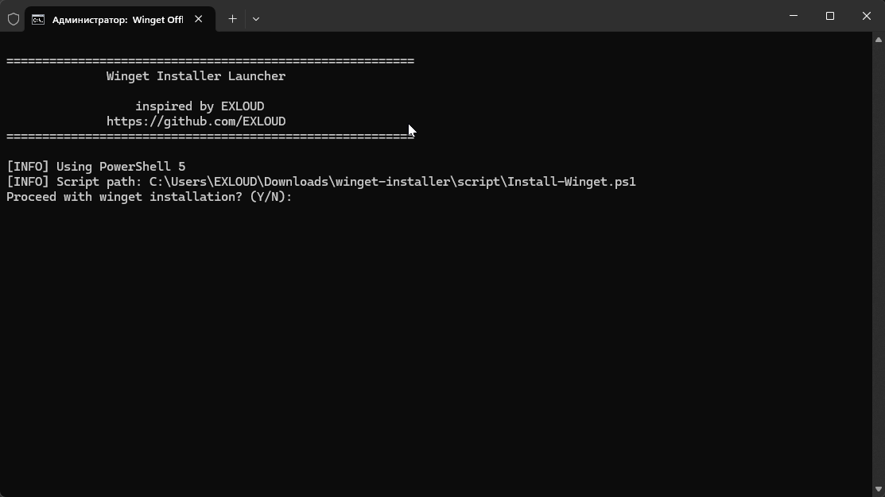

<div align="center">

### 👀 Repository Views


**⭐ If this tool helped you, please consider giving it a star! ⭐**

---

  <h1>Winget Installer</h1>
  
  <p>
    <a href="https://github.com/microsoft/winget-cli/releases">
      
    </a>
    <a href="https://github.com/EXLOUD/winget-installer/archive/refs/heads/main.zip">
      
    </a>
  </p>
  
  
  
  ..
  
  [](https://github.com/EXLOUD/winget-installer/issues)
  
  
  
  
  [](https://github.com/EXLOUD/winget-installer/stargazers)

Online/Offline installer for Windows Package Manager (winget). This tool automatically handles all dependencies and configurations required for winget installation.

</div>

## 🚀 Features

- **🏗️ Multi-Architecture Support**: Works on x86, x64, and ARM64 systems
- **📦 Dependency Management**: Automatically installs VCLibs and UI.Xaml dependencies
- **🔒 Administrator Privileges**: Self-elevation for required permissions
- **🛡️ Privacy-First**: Disables telemetry by default
- **👥 System-Wide Installation**: Provisions winget for all users
- **🎯 Smart Detection**: Checks existing installations before proceeding
- **📝 Detailed Logging**: Comprehensive installation feedback

## 📋 Prerequisites

- Windows 10 version 1809 (17763) or later
- Windows 11 (any version)
- PowerShell 5.1
- Administrator privileges (automatically requested)

## 📁 Project Structure

```
winget-installer/
├── Launcher.bat                    # Main launcher script
├── script/
│   ├── Install-Winget.ps1         # PowerShell installation script
│   └── Files/                     # Installation files
│       ├── Microsoft.DesktopAppInstaller_8wekyb3d8bbwe.msixbundle
│       ├── e53e159d00e04f729cc2180cffd1c02e_License1.xml
│       ├── Microsoft.VCLibs.14.00_14.0.33728_x64.Appx
│       ├── Microsoft.VCLibs.14.00_14.0.33728_x86.Appx
│       ├── Microsoft.VCLibs.14.00_14.0.33728_arm64.Appx
│       ├── Microsoft.UI.Xaml.2.8_8.2501.31001_x64.appx
│       ├── Microsoft.UI.Xaml.2.8_8.2501.31001_x86.appx
│       └── Microsoft.UI.Xaml.2.8_8.2501.31001_arm64.appx
├── README.md
├── LICENSE
└── .github/
    └── workflows/
        └── release.yml
```

## 🔧 Installation

### Quick Start

1. **Download** the latest release
2. **Extract** the archive to your desired location
3. **Run** `Launcher.bat` as administrator
4. **Follow** the on-screen prompts

### Manual Installation

1. Clone the repository:
```bash
git clone https://github.com/EXLOUD/winget-installer.git
cd winget-installer
```

2. Download the required offline files (see [File Sources](#file-sources))

3. Run the launcher:
```cmd
Launcher.bat
```

## 📝 Usage

### Basic Usage

Simply run the `Launcher.bat` file. The script will:

1. **Check** for administrator privileges and request elevation if needed
2. **Detect** your system architecture automatically
3. **Verify** all required files are present
4. **Install** VCLibs dependencies for your architecture
5. **Install** Microsoft.UI.Xaml dependencies
6. **Check** if winget is already installed
7. **Install** winget offline packages
8. **Configure** winget for all users
9. **Disable** telemetry for privacy
10. **Add** winget to PATH if needed

### Command Line Options

The PowerShell script can be run directly with additional options:

```powershell
# Run with execution policy bypass
powershell -ExecutionPolicy Bypass -File "script\Install-Winget.ps1"

# Run with no profile for clean environment
powershell -NoProfile -ExecutionPolicy Bypass -File "script\Install-Winget.ps1"
```

## 🔍 File Sources

The offline installation files need to be downloaded from Microsoft's official sources:

### Core Winget Package
- **Microsoft.DesktopAppInstaller_1.11.400.msixbundle**
- **Microsoft.DesktopAppInstaller_License.xml**
  - Source: [GitHub Releases](https://github.com/microsoft/winget-cli/releases)

### Dependencies
- **VCLibs 14.00** (x86, x64, ARM64)  
  - Official (aka.ms) mirrors:
    - [](https://aka.ms/Microsoft.VCLibs.x86.14.00.Desktop.appx)
    - [](https://aka.ms/Microsoft.VCLibs.x64.14.00.Desktop.appx)
    - [](https://aka.ms/Microsoft.VCLibs.arm64.14.00.Desktop.appx)
  
- **Microsoft.UI.Xaml.2.8** (x86, x64, ARM64) and open as archive.....
  - Source: [NuGet Gallery](https://www.nuget.org/packages/Microsoft.UI.Xaml)

## 🛠️ Troubleshooting

### Common Issues

#### "PowerShell 5 not found"
- **Solution**: Install PowerShell 5.1 bcoz i'm lazzy for write/adapt by PS7 :D
- **Download**: [PowerShell 5.1](https://www.microsoft.com/download/details.aspx?id=54616)

#### "Script not found"
- **Solution**: Ensure the `script` folder is in the same directory as `Launcher.bat`
- **Check**: Verify the file structure matches the expected layout

#### "Access denied" errors
- **Solution**: Run `Launcher.bat` as administrator
- **Alternative**: Right-click → "Run as administrator"

#### "Winget not found after installation"
- **Solution**: Restart your command prompt or PowerShell session
- **Alternative**: Log out and log back in to refresh PATH

#### Missing offline files
- **Solution**: Download all required files and place them in the `script/Files/` directory
- **Check**: Verify file names match exactly (case-sensitive)

### Getting Help

If you encounter issues:

1. **Check** the [Issues](https://github.com/EXLOUD/winget-installer/issues) page
2. **Search** for similar problems and solutions
3. **Create** a new issue with detailed error messages
4. **Include** your Windows version and architecture

## 🔒 Security & Privacy

### Privacy Protection
- **Telemetry Disabled**: The script automatically disables winget telemetry
- **No Data Collection**: This installer doesn't collect or transmit any personal data
- **Local Installation**: All operations are performed locally on your system

### Security Considerations
- **Code Signing**: We recommend verifying the integrity of downloaded files
- **Administrator Rights**: Required for system-wide installation and PATH modification
- **Antivirus**: Some antivirus software may flag batch files - this is a false positive

## 🤝 Contributing

We welcome contributions! Please read our [Contributing Guidelines](CONTRIBUTING.md) before submitting pull requests.

### Development Setup

1. Fork the repository
2. Create a feature branch: `git checkout -b feature/amazing-feature`
3. Make your changes
4. Test thoroughly on different Windows versions
5. Commit your changes: `git commit -m 'Add amazing feature'`
6. Push to the branch: `git push origin feature/amazing-feature`
7. Open a Pull Request

### Code Style

- Use consistent indentation (4 spaces for PowerShell, 2 spaces for batch files)
- Add comments for complex logic
- Follow PowerShell best practices
- Test on multiple architectures when possible

## 📄 License

This project is licensed under the MIT License - see the [LICENSE](LICENSE) file for details.

## 🙏 Acknowledgments

- **Microsoft** for developing winget and providing the core packages
- **Community contributors** who have helped improve this installer
- **Beta testers** who provided valuable feedback

## 🔗 Related Projects

- [winget-cli](https://github.com/microsoft/winget-cli) - Official winget command-line tool
- [winget-pkgs](https://github.com/microsoft/winget-pkgs) - Official winget package repository
- [chocolatey](https://chocolatey.org/) - Alternative package manager for Windows

---

<div align="center">

**[⬆ Back to Top](#winget-installer)**

Made with ❤️ by [EXLOUD](https://github.com/EXLOUD)

</div>
